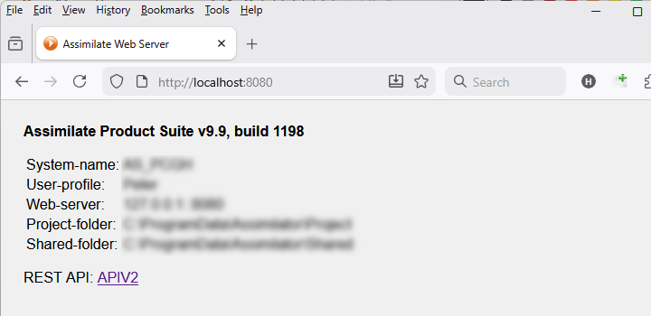
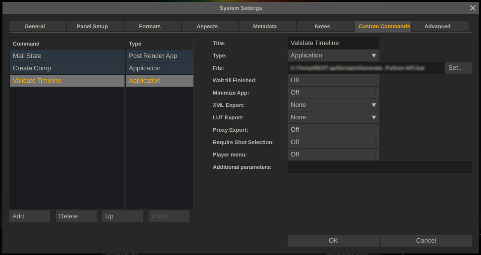

**General**

The Assimilate REST API provides a programming interface to the data and
functions of the Assimilate Product Suite software: manage projects,
load and edit media clips, playback and render media, etc. *The REST API is currently only available with a special BETA build of the Assimilate Product Suite, which is not yet publically available*. 

The REST API is available through a http webserver within the Assimilate
software, which is activated through the System Settings in the
application. (Note that not all applications in the product suite
provide REST access or provide a limited function-set (see overview at
the end of this description).

In the System Setting you specify to start the webserver by default,
which port to use and (optionally) a specific key to use to restrict
access.


When adding a security key, each http-call to the server has to contain 
the key in the http header <*Authorization: key*>, otherwise the webserver 
will respond with a 403 state.

Once the webserver is activated, the REST API is available. You can open
the default page for the system, which shows information of the
installed setup and provides a link to the REST API documentation.




**Python**

The core (REST) API works over http. To be easily used in a scripting
language like Python a Pythion wrapper library was created. All examples
for using the REST API provided in this Git, are in Python and are using
the wrapper library.

The library can be installed directly from the command line using:

pip install git+https://github.com/Assimilate-Inc/Assimilate-REST.git

The documentation of the wrapper Python library is available from this
Git, here: [Documentation](docs/README.md)

**OpenAPI**

The Assimilate REST has been designed according to the OpenAPI
Specification (OAS), where the full specs of the API are contained in a
YAML file, available on this Git. This file can be used to create API
wrappers for other environments / languages, like e.g. C#, or to create
alternative formatted documentation.

**MCP (Model Context Protocol)**

An MCP server is available that provides complete coverage of the
Assimilate REST API — 85 tools across 14 categories (system, projects,
groups, constructs, slots, versions, shots, inputs, color grading,
player, render, outputs, snapshots, and files).

[MCP](https://modelcontextprotocol.io) is an open standard that allows
applications to interact with external tools and services through a
unified protocol. The Assimilate MCP server translates MCP tool calls
into REST API requests against a running Live FX or SCRATCH instance,
enabling natural language control of the full production pipeline —
dailies, color grading, compositing, rendering, and media management.

The MCP server is available as an npm package and can be installed with
a single command:

```
npx assimilate-mcp
```

Full documentation, setup instructions, and source code:
[AssimilateMCP](https://github.com/amac-roguelabs/assimilate-mcp)

**API**

The REST API is buildup of 3 modules:

- System – manage system settings of the local installation, e.g. system
  name, version, local paths, etc.
- Project – manage project (meta)data, e.g. create a project, load
  media, manage a timeline or composite, etc.
- Application – invoke application functions, e.g. start/stop playback,
  start a render, etc.

The Project module is the most extensive. To understand its usage, it is
important to grasp the setup and hierarchy of projects in the Assimilate
Product Suite software. The user guide on the support site
([https://www.assimilatesupport.com](https://www.assimilatesupport.com)) provides detailed information.
Below is a short overview of the object-hierarchy.

- Project. A Project is the highest level of media organization in the
  software.
- Group. Media organization. A Project contains one or more Groups,
  where each Group contains one or more of Constructs/Timelines.
- Constructs (/Timelines). The word Construct and Timeline are
  equivalent in this context. It contains a series of (media)shots where
  ‘Timeline’ reflects a logical way of playback and ‘Construct’ reflects
  more just a grouping.
- Slots. A Construct contains one or more Slots, where each slot has a
  certain length and can contain no, one or multiple Shots. The first
  Shot in a Construct represents the timeline shot with the other Shots
  that might be stacked on top of it can be regarded as versions.
- Shot. A shot can be a source image sequence (of a wide range of
  image/camera formats), a live capture, an image effect (plug-in) that
  takes a source image as input or an image generator. Most generic
  properties of a Shot are exposed through the REST API but any Shot
  might also have a series of custom properties which are not exposed
  directly.
- Grade. Any Shot can contain a (color)grade to adjust the look of the
  shot. A grade is made up of a series of color effects. A Shot has a
  primary grade and on top can contain Layers, each with their own grade
  or input image to stack effects / images.
- Layer. A Layer on a Shot has a Canvas that reflects its size and
  position on the base Shot. A Layer can contain a Grade of its own and
  can contain a fill or matte Shot to add an image to the source image
  or apply a specific effect. Layers can be grouped to offset their size
  and position together.
- Input. A (effect) Shot can have one or more Input (Shots). This is an
  alternative model than a Layer for compositing shots together. E.g. a
  re-timer effects Shot might take in an ProRes source Shot to speed up
  or create a slomo version of the shot.
- Output. An Output is basically a Shot, which can render images to a
  specific file format. Outputs are usually tied to a Construct/Timeline
  and can optionally be chained together to create an output pipeline to
  produce different versions of the same timeline.
- Tray. Media organization. A Project can contain multiple Trays, which
  in turn contain Shots. A Tray can be used to group Shots (or
  references of Shots) and provide quick access with any
  Construct/Timeline that is being worked on.

**Versioning**

Just like the Assimilate Product Suite software will continue to grow,
the REST API for it will evolve with it. Currently not all properties
and functions that you encounter through the user interface are (yet)
exposed through the REST API. The aim is though that over time and
depending on demand, more / all functions will be available through the
REST API.

The REST API has its own version number, which is tied to a specific
version and build-number of the Assimilate Product Suite. Although we
try to maintain compatibility between versions, this is not fully
guaranteed. Keep an eye out for new versions of the Product Suite, where
any update of the REST API is mentioned. In the release history on this
Git, the supported version and build-numbers of the product suite are
mentioned.

**Custom Commands**

Any script to interact with the REST API can be invoked externally from
the software, and since the REST API works over http, even from another
system. However, the software itself also provides a way for the user to
invoke a script to customize the (inner workings of) the software:
custom commands. Custom commands are defined in the System Settings of
the software.



A Custom Command can be defined as a button, which will appear in the
menus when inside a project in the software, or as a system event –
where the script is invoked on e.g. start / stop the software, open /
close a project or switching user profiles.

With a Custom Command tyou can also define user-input fields. These are 
presented to the User when invoking a Custom Command. A field can be
text input, a dropdown option list, numeric input or a yes/no option. 
All the user input is passed on to the underlying script in command line
parameters.

**Support**

The Assimilate Product Suite is available for Windows and MacOS. The
installer can be downloaded from the support site:
[https://www.assimilatesupport.com/akb/Downloads.aspx](https://www.assimilatesupport.com/akb/Downloads.aspx)

The user guide and additional specialized documentation is also
available from that site:
[https://www.assimilatesupport.com/akb/Knowledgebase.aspx](https://www.assimilatesupport.com/akb/Knowledgebase.aspx)

To run the software, you need a valid license. Trial licenses are
available through the registration page from the main website:
[https://www.assimilateinc.com/](https://www.assimilateinc.com/)

The best place for support on the Assimilate REST API is to join our
Discord channel and open the specific REST API topic:

If you have a valid support contract, then you can also contact us
through the regular email support channel.

The availability and coverage of the REST API depends on the specific
application within the Assimilate Product Suite that is used, as well as
the active toolset and license that is used.

